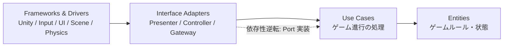
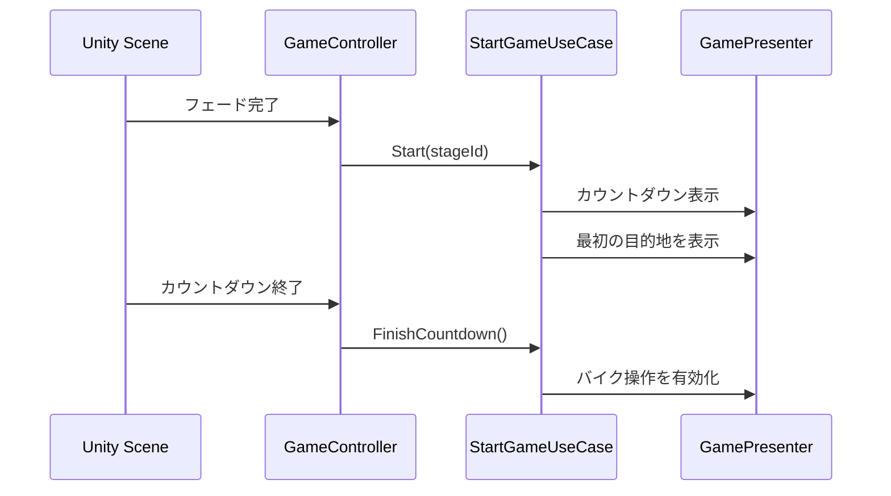
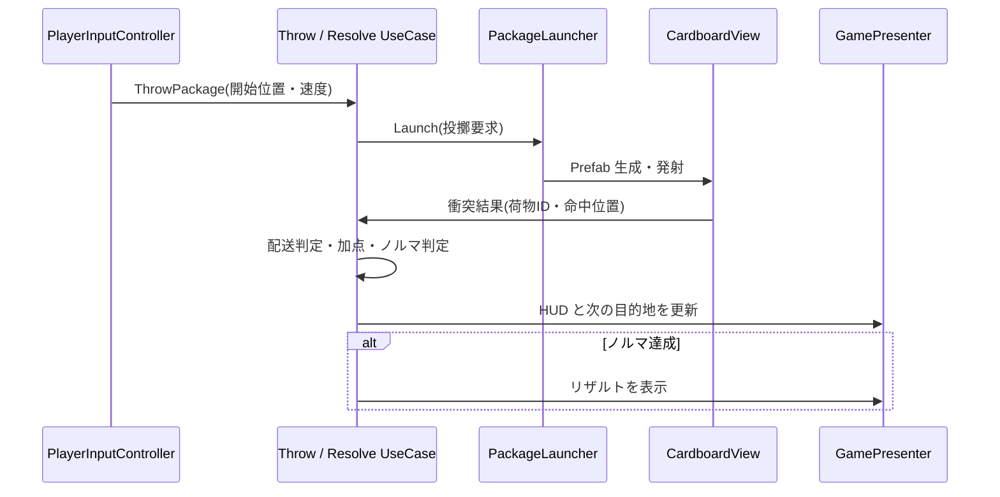

# ShoulderDerivery クリーンアーキテクチャ設計書

## 1. 目的

ゲームルールを Unity の `MonoBehaviour`、Input System、UI、物理演算から分離し、ゲーム進行とスコア計算を Unity を起動せずにテストできる構成にする。

採用する 4 層は以下のとおり。



- ソースコードの参照は **外側から内側へ** の一方向に限定する。
- 実行時の通知は内側から外側へ流れてよいが、内側は外側の具象クラスを参照しない。通知先は Use Case 層で定義したインターフェース（Port）にする。
- Unity 固有型（`MonoBehaviour`、`GameObject`、`Vector3`、`Time`、`InputAction` など）は Frameworks & Drivers 層だけに置く。

## 2. レイヤー定義

| 層 | 責務 | 置くもの | 置かないもの |
| --- | --- | --- | --- |
| Entities | 変化しにくいゲームルールと状態 | `StageState`、`DeliveryState`、`Score`、`Quota`、`Grade`、スコア算出規則 | Unity API、シーン遷移、UI、リポジトリ |
| Use Cases | 1 ユースケース単位のゲーム進行制御 | 開始、カウントダウン終了、投擲、配達判定、タイムアップ、リザルト計算 | `MonoBehaviour`、具体的な UI・物理実装 |
| Interface Adapters | 入出力をユースケース用データへ変換 | Input Controller、Presenter、Repository/Scene Gateway 実装 | ゲームルールの判断、直接的な Unity API 呼び出し |
| Frameworks & Drivers | Unity や外部機能の詳細 | View、Input System、Physics、SceneManager、ScriptableObject、Audio、具体 UI | ルール・スコア計算・進行判断 |

## 3. ドメインモデル（Entities）

### 主な Entity / Value Object

| 型 | 主な状態・責務 |
| --- | --- |
| `StageDefinition` | ステージ ID、制限時間、配達ノルマ、目的地リスト、評価境界値 |
| `StageState` | 開始前／カウントダウン中／プレイ中／リザルト中、残り時間、現在の配達数 |
| `DeliveryState` | 現在の目的地、配送済み数、ノルマ達成状態、投擲数 |
| `ThrowResult` | 投擲したか、到達位置、投擲距離、配送成功可否 |
| `ScoreBreakdown` | 基本点、投擲数点、時間点、距離点、バイクアクション点、合計 |
| `Grade` | `C` / `B` / `A` の 3 段階評価 |

### Entity が守るルール

- ノルマは「配送成功数が必要配送数以上」で達成する。
- 残り時間が 0 以下ならタイムアップする。
- ノルマ達成とタイムアップが同フレームで起きた場合は、ノルマ達成を優先してクリアとする。
- スコアは配送成功時に確定する要素と、リザルト時に確定する要素を分ける。
  - 配送成功時: 基本点、投擲距離点、配送時点のバイクアクション点。
  - リザルト時: 投擲数点、残り時間または経過時間点、合計、評価。
- 評価は `ScoreBreakdown.Total` と `StageDefinition` の境界値だけで決定する。

スコア計算は `ScoreCalculator` のような純粋な Entity に集約し、Presenter や View には置かない。

## 4. ユースケース（Use Cases）

### 用意するユースケース

| ユースケース | 入力 | 主な処理 | 出力 |
| --- | --- | --- | --- |
| `StartGameUseCase` | `stageId` | ステージ定義を取得し、状態を初期化、最初の目的地を設定 | カウントダウン開始要求 |
| `FinishCountdownUseCase` | なし | 状態をプレイ中へ変更 | バイク操作有効化要求 |
| `TickGameUseCase` | `deltaSeconds` | 残り時間を減算し、タイムアップを判定 | HUD 更新／リザルト要求 |
| `BeginThrowUseCase` | プレイヤー位置・向き | 荷物生成に必要な情報を返す | 投擲ガイド表示要求 |
| `ThrowPackageUseCase` | 投擲開始位置・速度 | 投擲数を加算し、物理生成を依頼 | 荷物生成要求 |
| `ResolveDeliveryUseCase` | 荷物 ID、命中位置、バイクアクション情報 | 目的地との配送可否を判定、成功なら加点・次目的地設定 | HUD 更新／目的地更新／リザルト要求 |
| `ShowResultUseCase` | 終了理由 | 最終スコアと評価を確定 | リザルト表示要求 |
| `ChangeSceneUseCase` | 遷移先 | フェード後のシーン遷移を依頼 | フェード／シーン遷移要求 |

`TickGameUseCase` は `Update` を持たない。`GameController` が Unity の `Update` から `deltaTime` を渡して呼び出す。

### Use Case の Port

Use Case 層は実装ではなく、必要な入出力を Port として定義する。

```csharp
public interface IStageRepository
{
    StageDefinition Find(StageId stageId);
}

public interface IPackageLauncher
{
    void Launch(PackageLaunchRequest request);
}

public interface IGameOutputPort
{
    void ShowHud(GameHudViewModel viewModel);
    void ShowResult(ResultViewModel viewModel);
    void SetBikeControlEnabled(bool enabled);
    void SetDestination(DestinationViewModel viewModel);
}
```

Port は Use Case 層に置き、実装は外側の層に置く。これにより、Use Case は Unity の UI、Prefab、物理実装を知る必要がない。

## 5. Interface Adapters

### Controller

- `GameController`: シーン開始、Unity の `Update`、フェード完了、タイマーをユースケース呼び出しへ変換する。
- `PlayerInputController`: PC とコントローラーの入力を `BeginThrowUseCase` / `ThrowPackageUseCase` などの入力 DTO に変換する。
- `PackageCollisionController`: `OnCollisionEnter` / `OnTriggerEnter` の結果を `ResolveDeliveryUseCase` に渡す。
- `ResultNavigationController`: ステージ選択・タイトル選択を `ChangeSceneUseCase` に渡す。

Controller は「入力を変換して Use Case を呼ぶ」だけにし、ノルマやスコアを判定しない。

### Presenter

- `GamePresenter`: `IGameOutputPort` を実装し、Use Case の出力を HUD、目的地マーカー、操作可否、リザルト ViewModel に変換する。
- `SceneTransitionPresenter`: フェード開始・完了とシーン遷移を扱う。

Presenter は View に表示用データを渡す。View が Entity を直接読む構成にはしない。

### Gateway / Repository

- `StageRepository`: `StageDefinition` を ScriptableObject 等のマスターデータから復元する。
- `PackageLauncher`: 要求 DTO から荷物 Prefab をプール取得・配置・物理発射する。
- `PlayerActionGateway`: バイクのジャンプ、ドリフト、滞空などを集計し、Use Case が扱う `BikeActionScoreInput` を提供する。

## 6. Frameworks & Drivers（Unity）

| Unity 実装 | 担当する詳細 |
| --- | --- |
| `PlayerView` | Rigidbody を使ったバイク移動・旋回、カメラ追従 |
| `CardboardView` / `CardboardPool` | Prefab の生成・再利用、Rigidbody への力の適用、衝突検出の通知 |
| `TargetView` | 目的地の見た目、当たり判定、ガイド表示 |
| `HudView` / `ResultView` | Text、ゲージ、評価、ボタンの表示 |
| `SceneLoader` / `FadeView` | フェードと Unity SceneManager による遷移 |
| ScriptableObject マスタ | ステージ、荷物、目的地、配点の編集・保存 |

## 7. 代表フロー

### インゲーム開始から操作可能まで



### 投擲から配送成功まで



## 8. 現在の `Assets/Scripts/CleanArchitecture` への対応

| 現在の場所 | 方針 |
| --- | --- |
| `Entity` | 4 層の Entities として維持。`CardboardEntity` / `TargetEntity` は Unity 非依存にする。 |
| `UseCase` | 4 層の Use Cases として維持。ゲーム進行・配送・スコア・リザルトを追加する。 |
| `Adapter` | Interface Adapters に改称相当。`PlayerPresenter`、各 Controller、Gateway を配置する。 |
| `Infrastructure/Cocrete` | Frameworks & Drivers。`PlayerView`、Pool、View、Unity 実装を配置する。 |
| `Repository/Interface` | Use Case が必要とする Port として `UseCase` 配下または `UseCase/Port` に移す。 |
| `Repository/Concrete` | 外側の Adapter または Infrastructure の実装として配置する。 |
| `Master` | ScriptableObject など Unity のデータソースなので外側に置く。Entity が直接参照しない。 |
| `Common` | 依存のない ID、列挙、値オブジェクトだけを置く。便利クラスの置き場にはしない。 |

特に、現在の `CardboardEntity` と `TargetEntity` が `Master` を直接参照する点は修正対象とする。`Master` は Unity の ScriptableObject として外側に置き、`StageRepository` などがその値から Entity を生成する。

## 9. 推奨フォルダ構成

```text
Assets/Scripts/CleanArchitecture/
  Entity/
    Stage/
    Delivery/
    Score/
  UseCase/
    Port/
    Input/
    Output/
  Adapter/
    Controller/
    Presenter/
    Gateway/
    Repository/
  Infrastructure/
    Unity/
      Player/
      Package/
      Target/
      UI/
      Scene/
    Master/
  CompositionRoot/
```

`CompositionRoot` は Unity シーン上の `MonoBehaviour` として置き、Repository、Presenter、Use Case、Controller の生成と依存性注入だけを行う。Use Case 内で `new PlayerView()` や `FindFirstObjectByType` は行わない。

## 10. 実装順序

1. `StageState`、`DeliveryState`、`ScoreCalculator`、`Grade` を Entity として定義する。
2. `StartGame`、`TickGame`、`ResolveDelivery`、`ShowResult` の Use Case と Port を作る。
3. HUD・リザルト・目的地表示用の Presenter と ViewModel を作る。
4. Player / Cardboard の Unity 実装を Controller と Gateway 経由で Use Case につなぐ。
5. シーン遷移とフェードを `ChangeSceneUseCase` と `SceneTransitionPresenter` へ接続する。
6. Entity と Use Case の単体テストを Unity 非依存で追加する。
